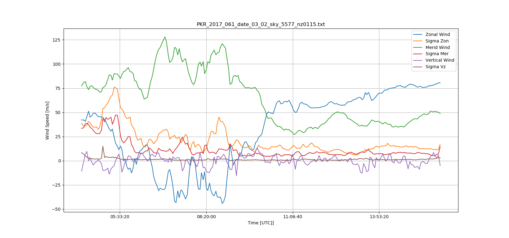

[](https://travis-ci.org/scivision/scanning-doppler-interferometer)
[](https://ci.appveyor.com/project/scivision/scanning-doppler-interferometer)
[](https://coveralls.io/github/scivision/scanning-doppler-interferometer?branch=master)

# Scanning Doppler Interferometer

Get, Parse, Plot: Scanning Doppler Interferomter data from PI Mark Conde's instruments.



## Install

    pip install -e .

Self-test:

    pytest -v

## Usage
```sh
PlotWinds data/PKR_2017_061_date_03_02_sky_5577_nz0115.txt
```
